# RadioGuessr — Architecture Diagrams

> Render in any Mermaid-compatible viewer: GitHub, VS Code (Markdown Preview Mermaid Support extension), or mermaid.live

---

## 1. System Architecture Overview

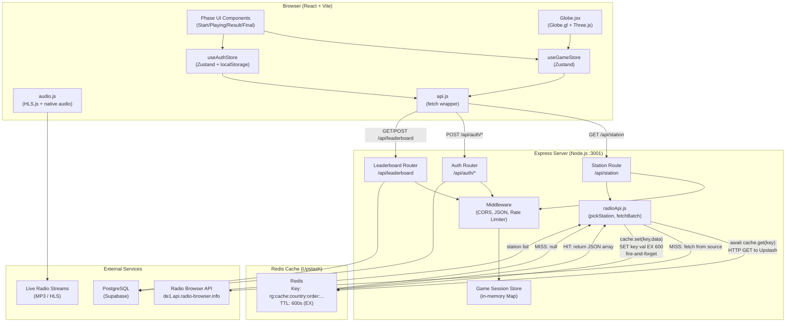

---

## 2. Game State Machine (Phase Transitions)

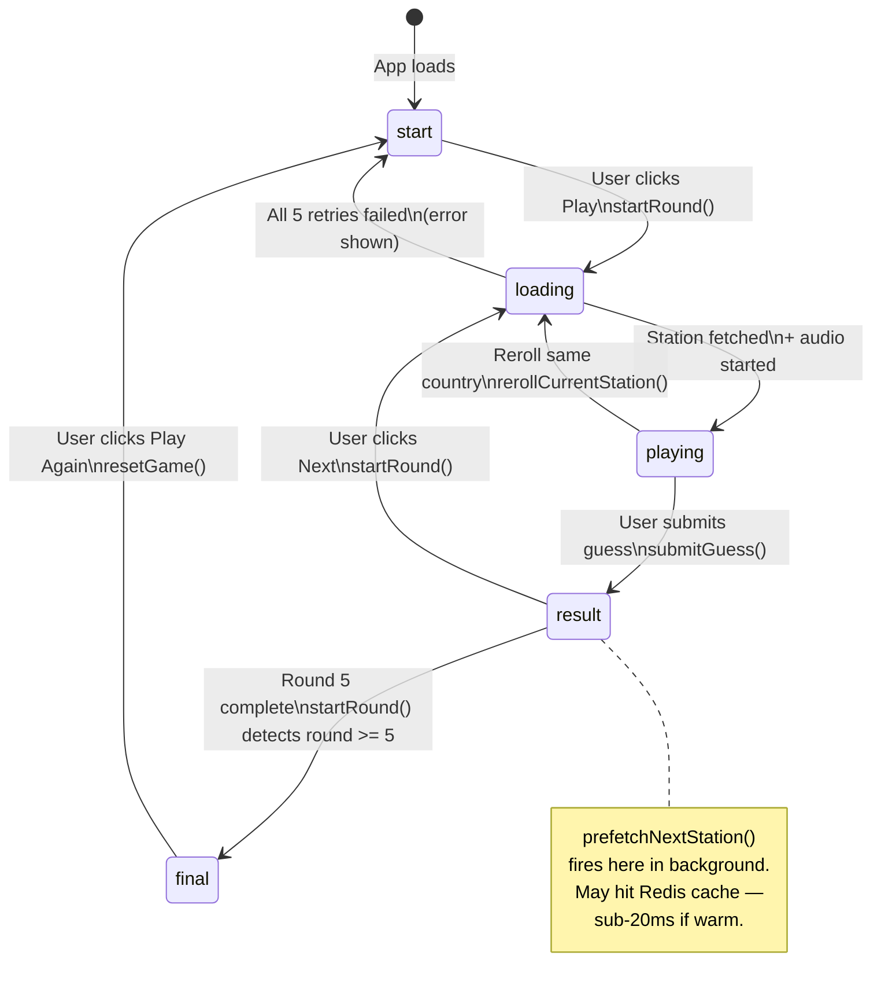

---

## 3. ER Diagram (Database Schema)

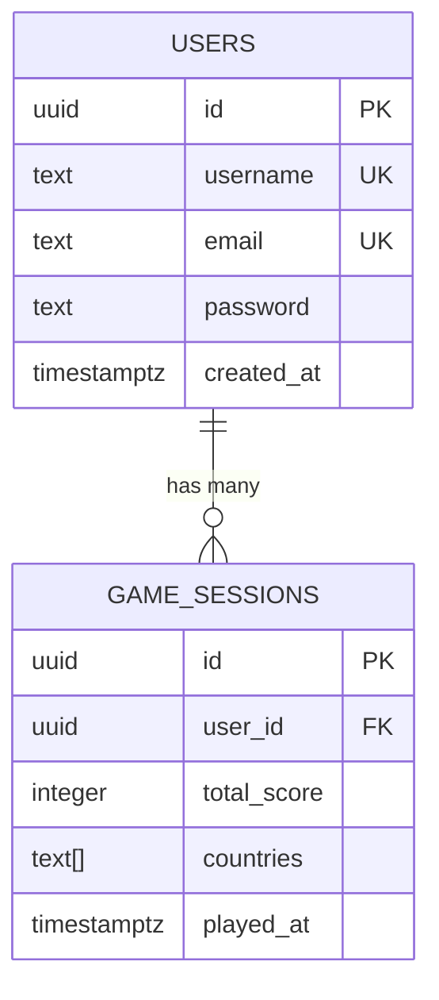

---

## 4. Request Lifecycle — Station Fetch (with Redis)

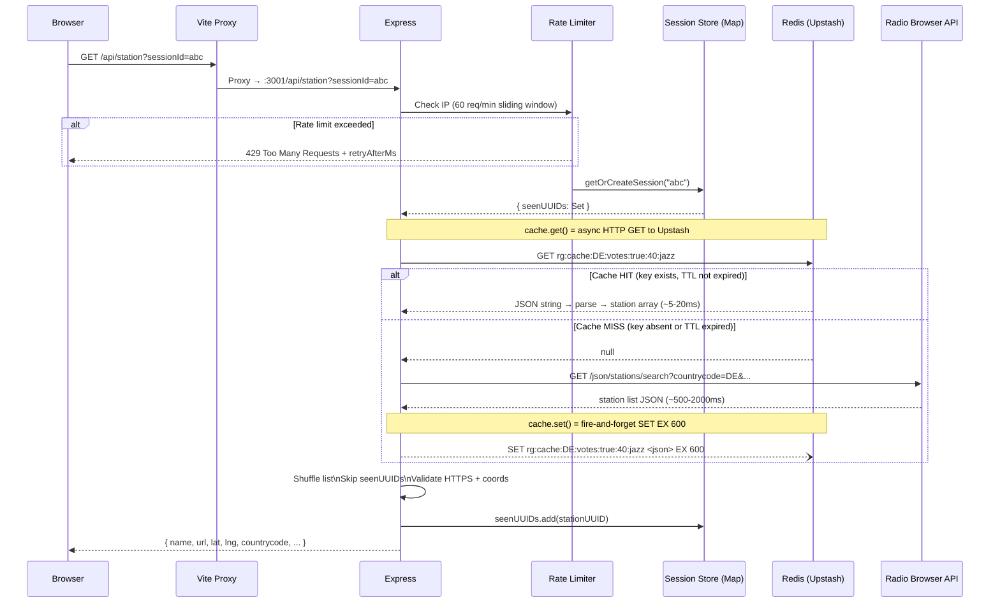

---

## 5. Redis Cache — Hit vs Miss Flow

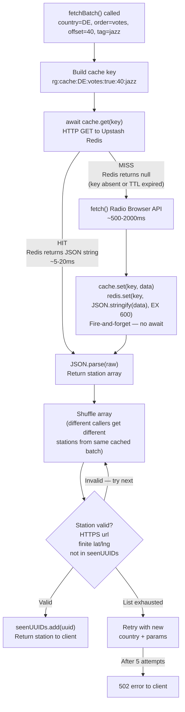

---

## 6. Redis Key Lifecycle

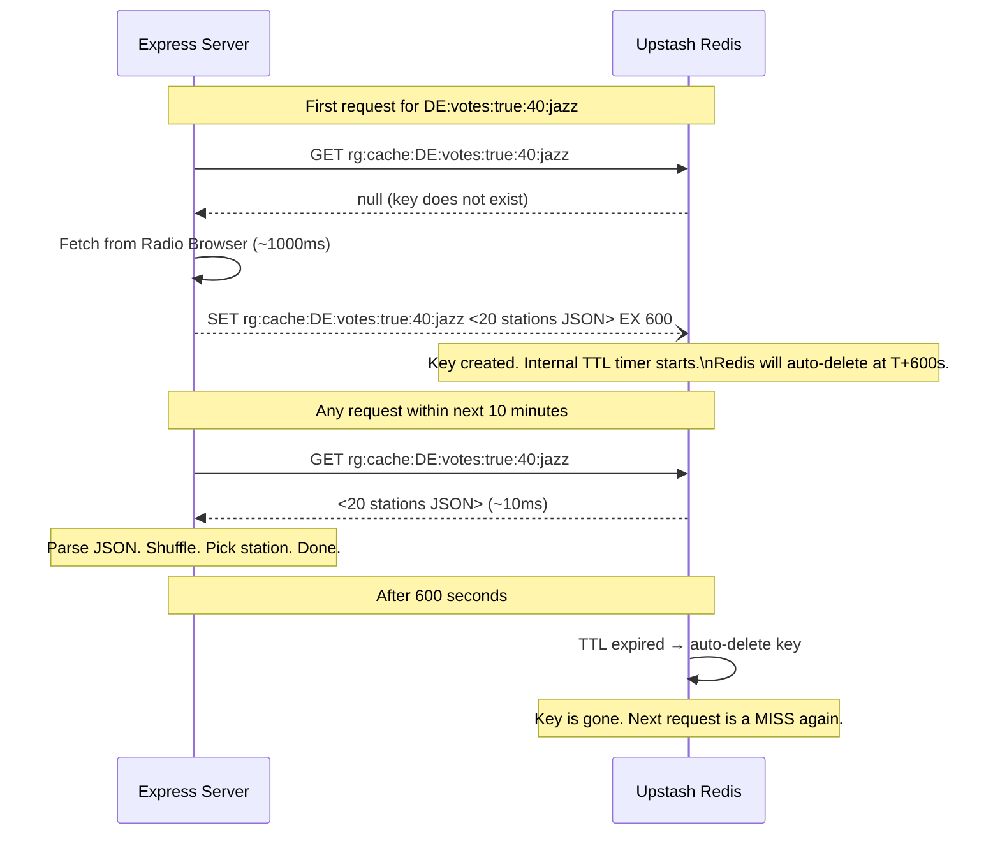

---

## 7. Auth Flow — Register and Login

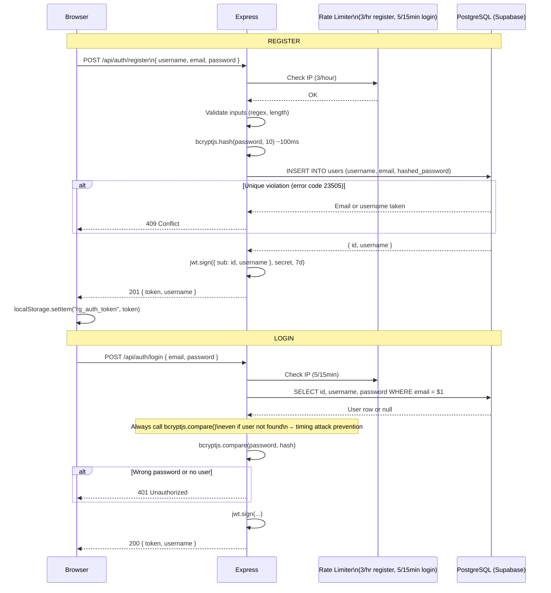

---

## 8. Rate Limiter — Sliding Window

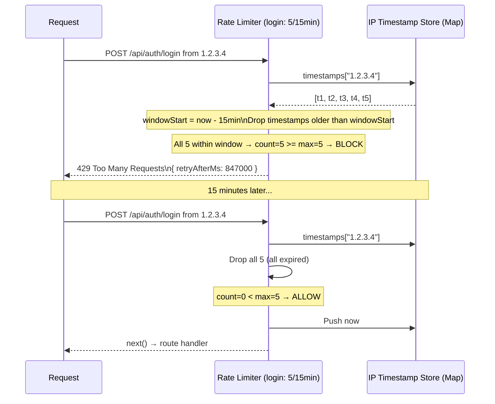

---

## 9. Station Prefetching — Timeline

```mermaid
gantt
    title Station Load Timeline (With vs Without Prefetch + Redis)
    dateFormat X
    axisFormat %ss

    section Without Prefetch (cold cache)
    User reads result screen       :a1, 0, 10
    Click Next - loading phase     :a2, 10, 11
    Redis MISS - fetch Radio Browser :a3, 11, 13
    Audio starts                   :a4, 13, 14

    section With Prefetch (cold cache)
    User reads result screen       :b1, 0, 10
    Prefetch fires - Redis MISS    :b2, 0, 2
    Prefetch ready in state        :milestone, b3, 2, 0
    Click Next - consume prefetch  :b4, 10, 11
    Audio starts                   :b5, 11, 12

    section With Prefetch (warm Redis cache)
    User reads result screen       :c1, 0, 10
    Prefetch fires - Redis HIT     :c2, 0, 1
    Prefetch ready sub-20ms        :milestone, c3, 1, 0
    Click Next - consume prefetch  :c4, 10, 11
    Audio starts instantly         :c5, 11, 11
```

---

## 10. Frontend Component Hierarchy

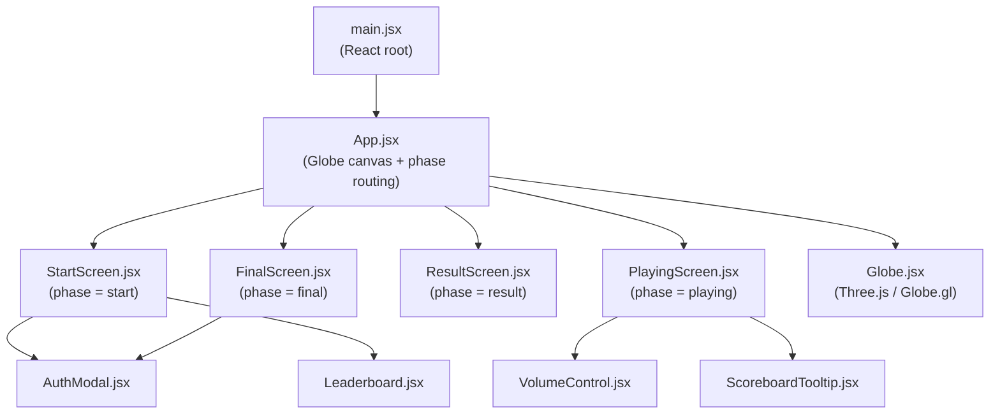

---

## 11. Deployment — Current vs Production Target

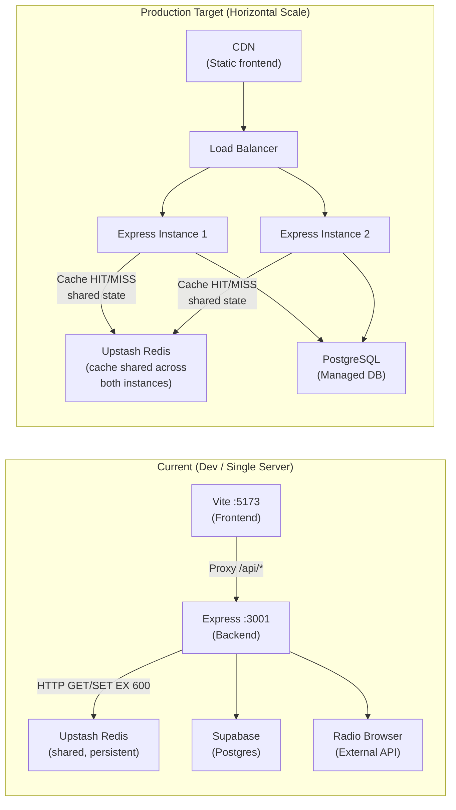

---

## 12. Score Calculation Visualised

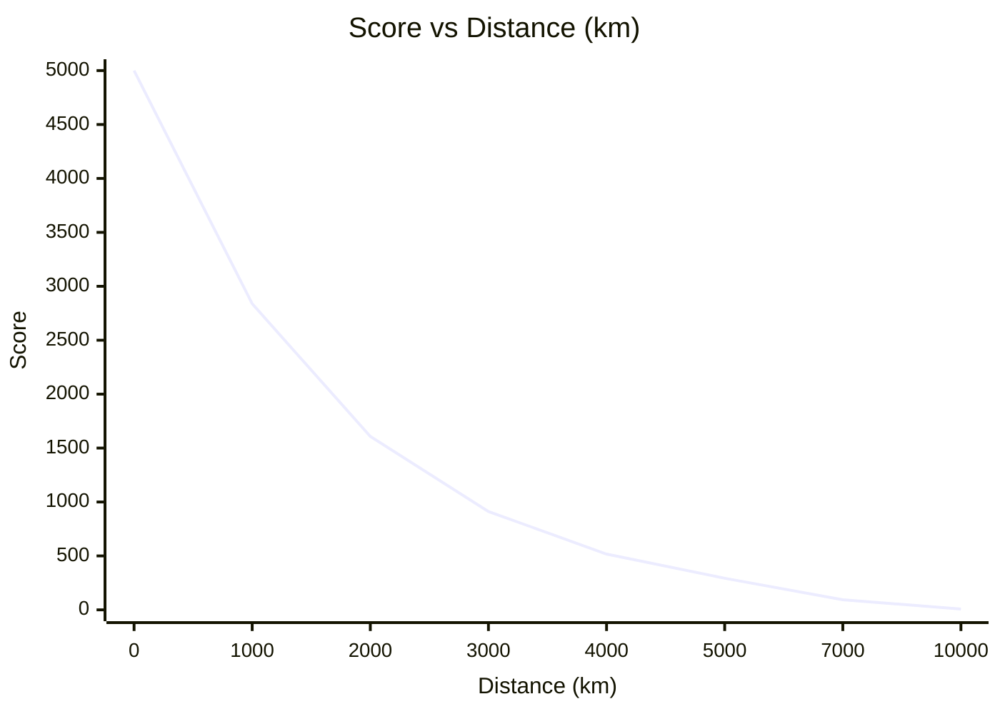

Formula: `score = 5000 × e^(−10 × km / 20015)`

| Distance | Score |
|---|---|
| 0 km (perfect) | 5,000 |
| 100 km | 4,754 |
| 500 km | 3,802 |
| 1,000 km | 2,888 |
| 2,000 km | 1,665 |
| 5,000 km | 293 |
| 10,000 km | 7 |
| 20,015 km (antipode) | ~0 |
