# 02 — Diagrams: URL Shortener Project
### All Architecture Diagrams — Renderable in GitHub, VS Code, mermaid.live

> **How to view:** Paste any diagram block into [mermaid.live](https://mermaid.live), or view this file on GitHub (renders automatically), or install the "Markdown Preview Mermaid Support" VS Code extension.

---

## Table of Contents

1. [System Architecture — Full Overview](#1-system-architecture--full-overview)
2. [High-Level Design (HLD)](#2-high-level-design-hld)
3. [Low-Level Design (LLD) — Backend Class Structure](#3-low-level-design-lld--backend-class-structure)
4. [ER Diagram — Database Schema](#4-er-diagram--database-schema)
5. [Request Lifecycle — POST /shorten (Full Sequence)](#5-request-lifecycle--post-shorten-full-sequence)
6. [Request Lifecycle — GET /r/{codeOrAlias} (Redirect)](#6-request-lifecycle--get-rcodeorialias-redirect)
7. [Request Lifecycle — GET /qr (QR Code Generation)](#7-request-lifecycle--get-qr-qr-code-generation)
8. [Request Lifecycle — GET /all (List URLs)](#8-request-lifecycle--get-all-list-urls)
9. [Frontend Component Hierarchy](#9-frontend-component-hierarchy)
10. [Frontend State Machine](#10-frontend-state-machine)
11. [Alias Validation Flow](#11-alias-validation-flow)
12. [Short Code Generation Algorithm](#12-short-code-generation-algorithm)
13. [TTL and Expiry Decision Tree](#13-ttl-and-expiry-decision-tree)
14. [Concurrency — Race Condition Handling](#14-concurrency--race-condition-handling)
15. [Deployment Diagram — Current Dev Setup](#15-deployment-diagram--current-dev-setup)
16. [Deployment Diagram — Ideal Production Setup](#16-deployment-diagram--ideal-production-setup)
17. [Package Dependency Graph](#17-package-dependency-graph)
18. [Data Lifecycle — A URL from Birth to Expiry](#18-data-lifecycle--a-url-from-birth-to-expiry)
19. [CORS Preflight Flow](#19-cors-preflight-flow)
20. [Handler Routing Map](#20-handler-routing-map)

---

## 1. System Architecture — Full Overview

Shows every component in the system and how they connect.

```mermaid
graph TB
    subgraph CLIENT["CLIENT — Browser"]
        UI["React App\n(App.jsx)\nlocalhost:5173"]
    end

    subgraph VITE["VITE DEV SERVER\nlocalhost:5173"]
        PROXY["Proxy Layer\nvite.config.js\n/shorten → :8080\n/r → :8080\n/all → :8080\n/qr → :8080"]
    end

    subgraph JAVA["JAVA BACKEND — localhost:8080"]
        MAIN["Main.java\nHttpServer\nThreadPool(4)"]

        subgraph HANDLERS["handlers/"]
            SH["ShortenHandler\nPOST /shorten"]
            RH["RedirectHandler\nGET /r/{code|alias}"]
            LH["ListHandler\nGET /all"]
            QH["QRHandler\nGET /qr?url=..."]
        end

        subgraph UTIL["util/"]
            VAL["Validator.java\nisValidUrl()\nvalidateAlias()"]
            JU["JsonUtil.java\nsendJson()\nsendImage()\nsendCors()\nextractJsonValue()"]
        end

        subgraph DB_LAYER["db/"]
            DBC["Database.java\ninit()\ngetConnection()\ncodeExists()"]
        end
    end

    subgraph STORAGE["STORAGE"]
        SQLITE[("SQLite\nurls.db\n\nTable: urls\ncode PK\nalias UNIQUE\noriginal_url\ncreated_at\nexpires_at\ndeleted")]
        ZXING["ZXing Library\ncore-3.5.2.jar\njavase-3.5.2.jar\nQR Generation"]
    end

    UI -->|"fetch('/shorten')\nfetch('/all')\nfetch('/qr?url=...')| PROXY
    PROXY -->|"forwards to :8080"| MAIN
    UI -->|"Browser navigates\nGET /r/code directly"| MAIN
    MAIN --> SH
    MAIN --> RH
    MAIN --> LH
    MAIN --> QH
    SH --> VAL
    SH --> JU
    SH --> DBC
    RH --> JU
    RH --> DBC
    LH --> JU
    LH --> DBC
    QH --> JU
    QH --> ZXING
    DBC -->|"JDBC\nDriverManager"| SQLITE
```

---

## 2. High-Level Design (HLD)

Shows the system from a 30,000-foot view — layers and responsibilities only, no code details.

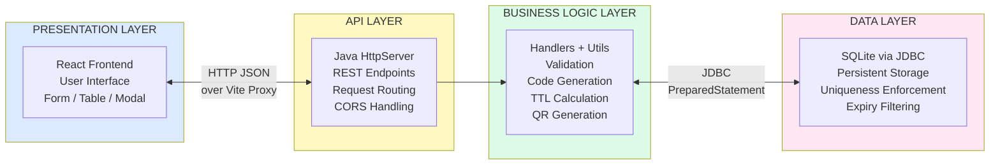

---

## 3. Low-Level Design (LLD) — Backend Class Structure

Shows every class, its methods, fields, and relationships.

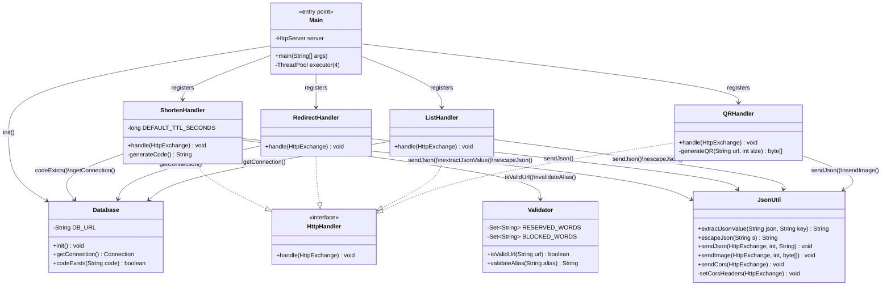

---

## 4. ER Diagram — Database Schema

The single table schema with all constraints shown.

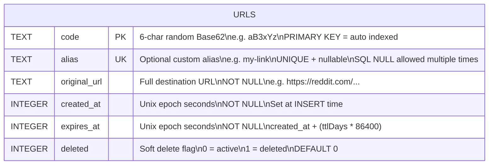

### Index Map

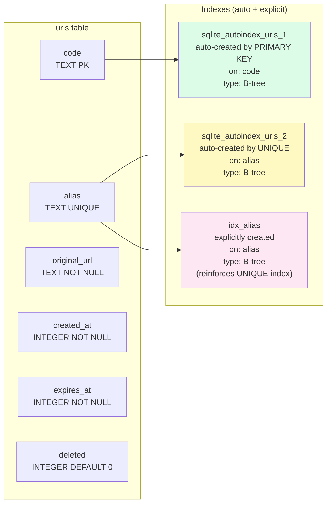

---

## 5. Request Lifecycle — POST /shorten (Full Sequence)

Every layer, every step, every decision point.

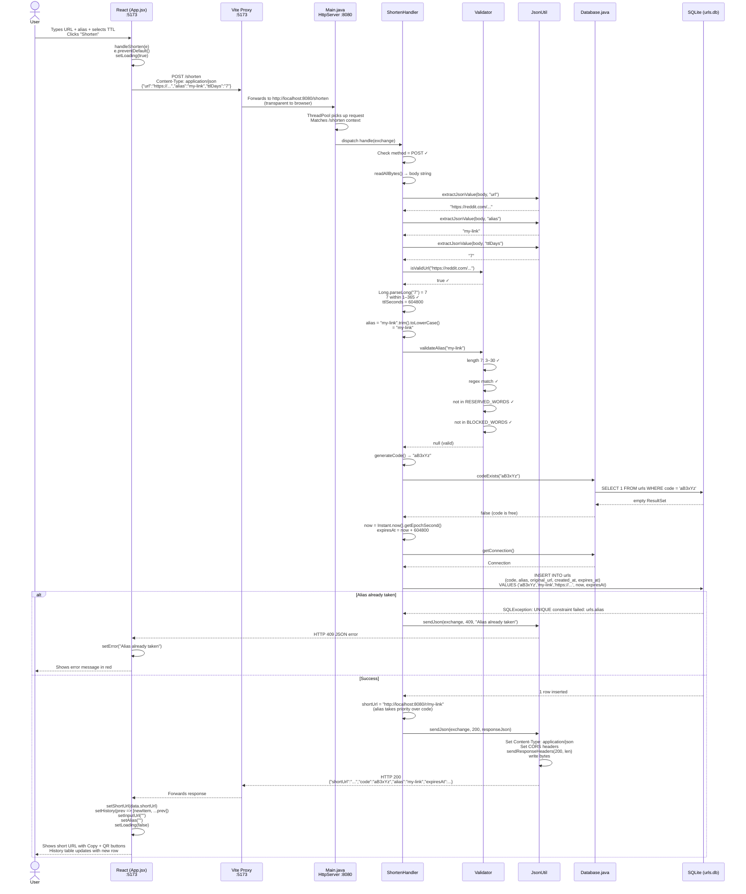

---

## 6. Request Lifecycle — GET /r/{codeOrAlias} (Redirect)

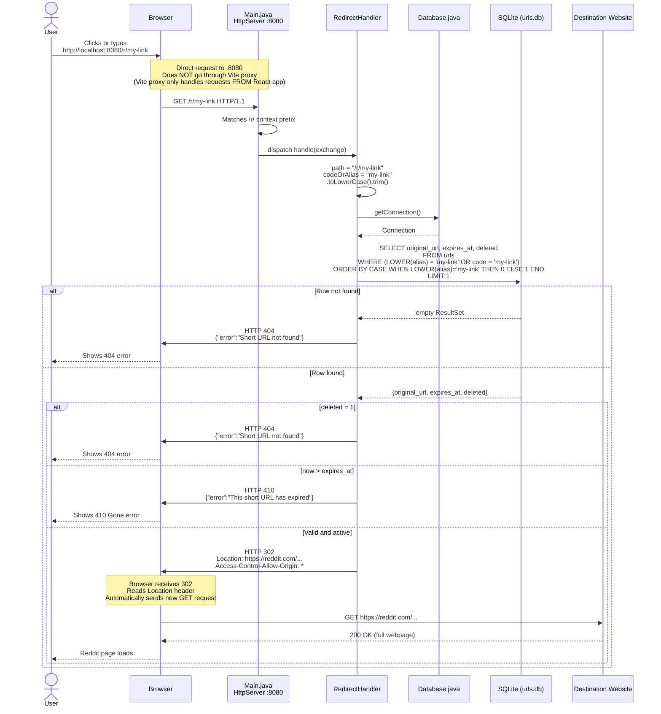

---

## 7. Request Lifecycle — GET /qr (QR Code Generation)

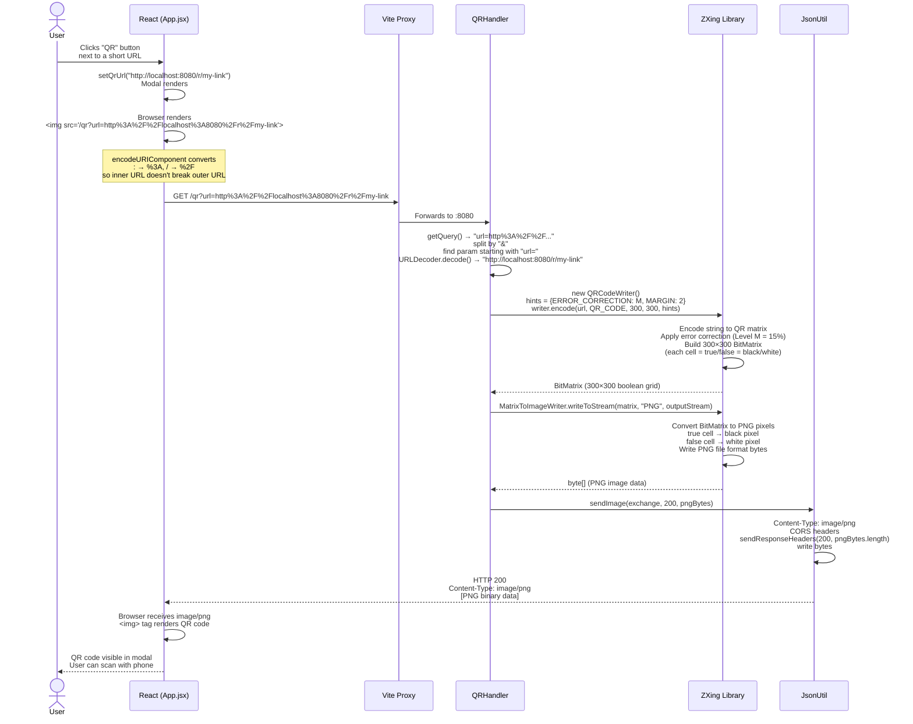

---

## 8. Request Lifecycle — GET /all (List URLs)

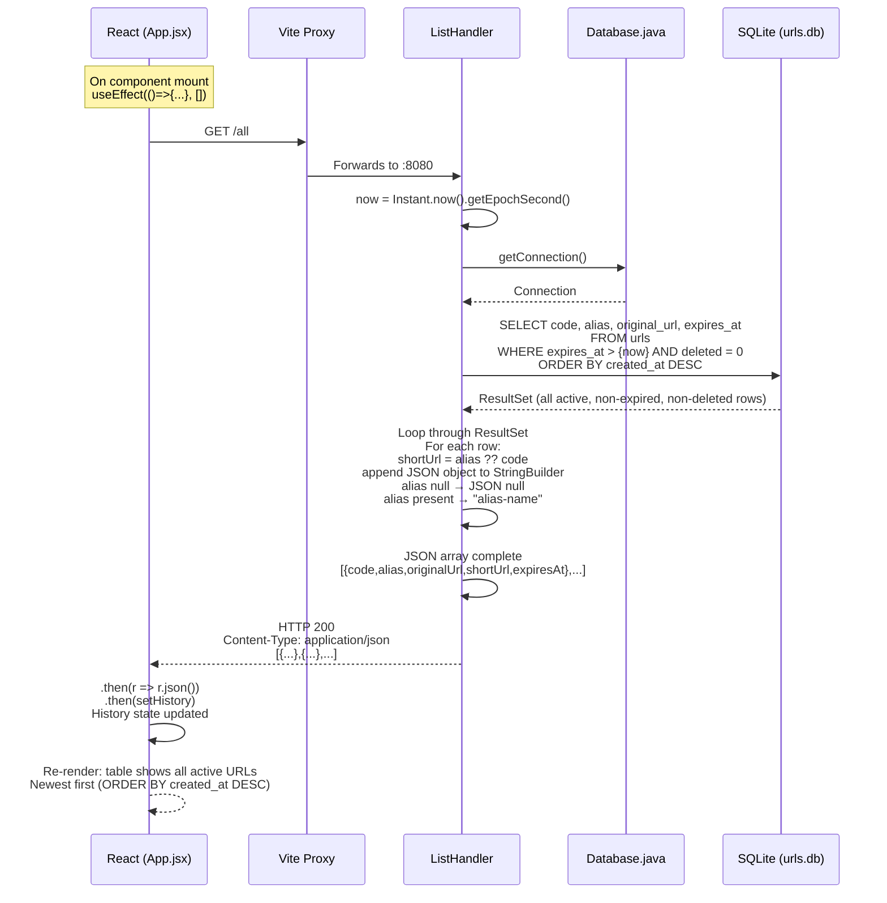

---

## 9. Frontend Component Hierarchy

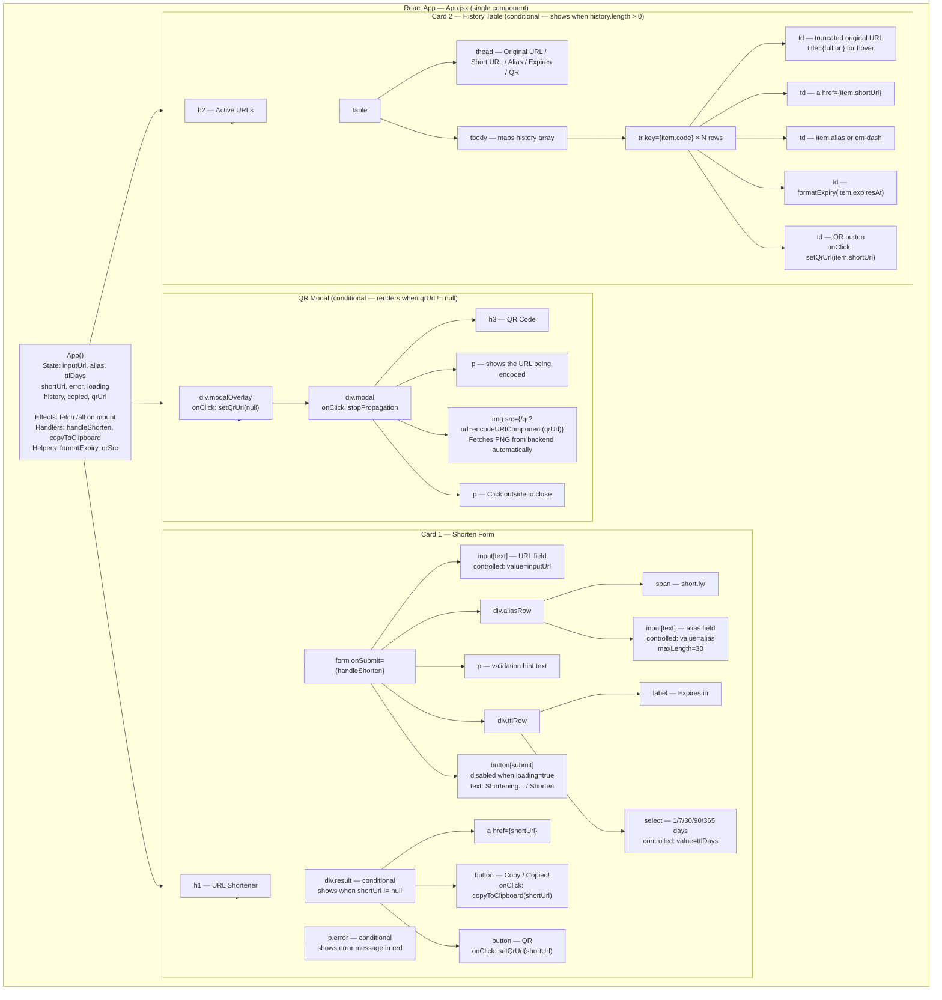

---

## 10. Frontend State Machine

All the states App.jsx can be in and what triggers transitions.

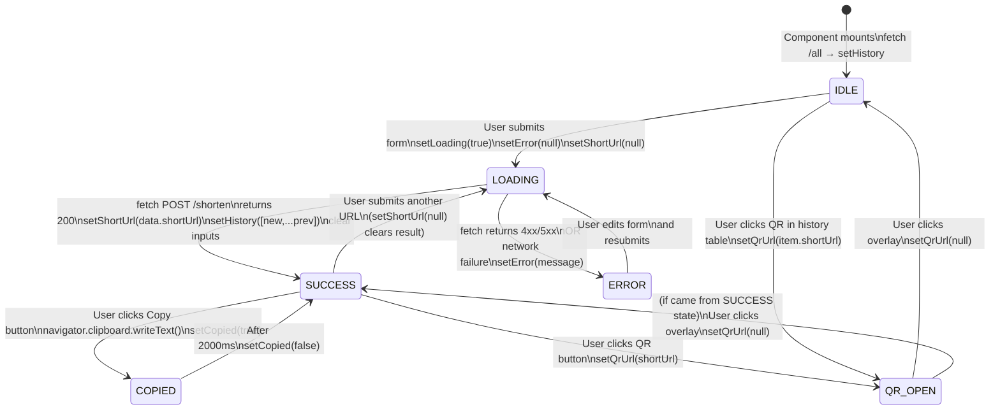

---

## 11. Alias Validation Flow

Every check in `Validator.validateAlias()` and `ShortenHandler` in sequence.

```mermaid
flowchart TD
    START([User submits alias]) --> BLANK{alias blank\nor null?}

    BLANK -->|Yes| SKIP[Skip alias processing\nalias = null\nUse random code instead]
    SKIP --> CODEGEN([Generate random code])

    BLANK -->|No| LOWER[alias = aliasRaw.trim().toLowerCase]
    LOWER --> LEN{Length\n3–30 chars?}

    LEN -->|No| E1[400: Alias must be\nbetween 3 and 30 characters]
    LEN -->|Yes| REGEX{"Matches regex\n[a-z0-9][a-z0-9\\-]*[a-z0-9]?"}

    REGEX -->|No| E2[400: Only letters, numbers,\nhyphens allowed.\nNo leading/trailing hyphens]
    REGEX -->|Yes| RESERVED{In RESERVED_WORDS?\nall, r, shorten, api,\nadmin, login, qr, etc.}

    RESERVED -->|Yes| E3[400: Reserved word\ncannot be used as alias]
    RESERVED -->|No| BLOCKED{In BLOCKED_WORDS?\ngoogle, facebook,\namazon, apple, etc.}

    BLOCKED -->|Yes| E4[400: Protected name\ncannot be used as alias]
    BLOCKED -->|No| VALID[Alias is valid\nproceed to INSERT]

    VALID --> INSERT[INSERT INTO urls\ncode, alias, url, timestamps]

    INSERT --> UNIQUE{UNIQUE\nconstraint\npasses?}
    UNIQUE -->|Yes| OK[200: Success\nreturn shortUrl with alias]
    UNIQUE -->|No| E5[409: Alias already taken\nchoose a different one]

    style E1 fill:#fca5a5
    style E2 fill:#fca5a5
    style E3 fill:#fca5a5
    style E4 fill:#fca5a5
    style E5 fill:#fca5a5
    style OK fill:#86efac
    style SKIP fill:#fef08a
```

---

## 12. Short Code Generation Algorithm

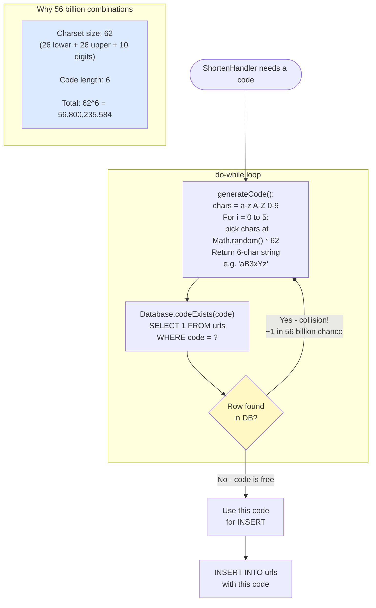

### Base62 Alternative (Interview Talking Point)

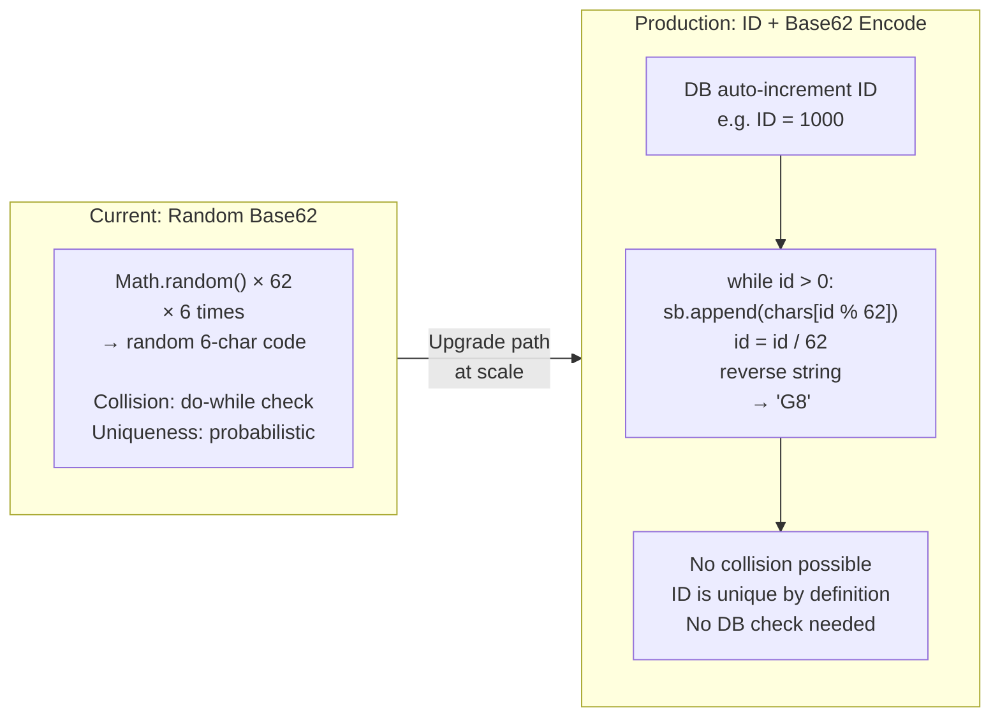

---

## 13. TTL and Expiry Decision Tree

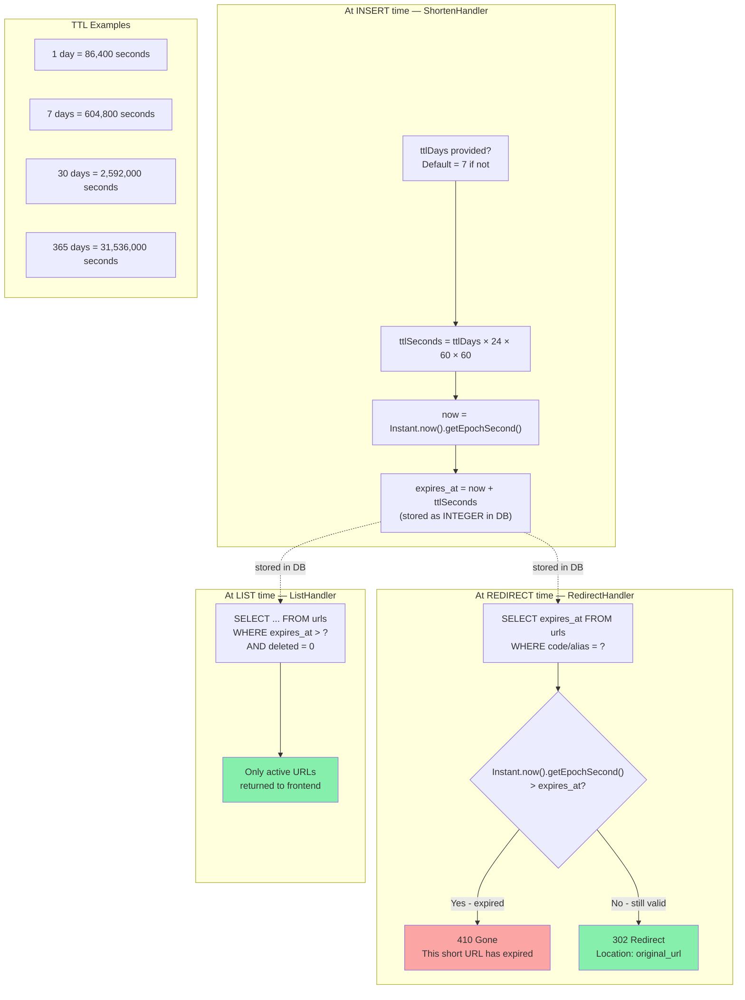

---

## 14. Concurrency — Race Condition Handling

Shows why we skip the existence check and go straight to INSERT.

```mermaid
sequenceDiagram
    participant T1 as Thread 1 (User A)
    participant T2 as Thread 2 (User B)
    participant DB as SQLite (urls.db)

    Note over T1,T2: Both users request alias "promo" simultaneously

    rect rgb(255, 220, 220)
        Note over T1,T2,DB: ❌ WRONG approach — check then insert
        T1->>DB: SELECT 1 WHERE alias = 'promo' → empty
        T2->>DB: SELECT 1 WHERE alias = 'promo' → empty
        Note over T1,T2: Both see "alias is free"
        T1->>DB: INSERT alias='promo' → success
        T2->>DB: INSERT alias='promo' → success (DUPLICATE DATA!)
    end

    rect rgb(220, 255, 220)
        Note over T1,T2,DB: ✅ OUR approach — go straight to INSERT
        T1->>DB: INSERT alias='promo'
        T2->>DB: INSERT alias='promo'
        Note over DB: DB's internal locking ensures<br/>only one INSERT wins
        DB-->>T1: Success (1 row inserted)
        DB-->>T2: SQLException: UNIQUE constraint failed: urls.alias
        T2->>T2: catch SQLException<br/>check message contains "UNIQUE constraint failed: urls.alias"
        T2-->>T2: return HTTP 409 Conflict<br/>"Alias already taken"
    end
```

---

## 15. Deployment Diagram — Current Dev Setup

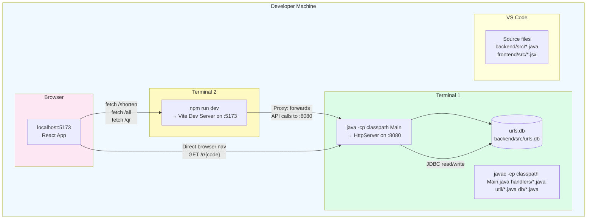

---

## 16. Deployment Diagram — Ideal Production Setup

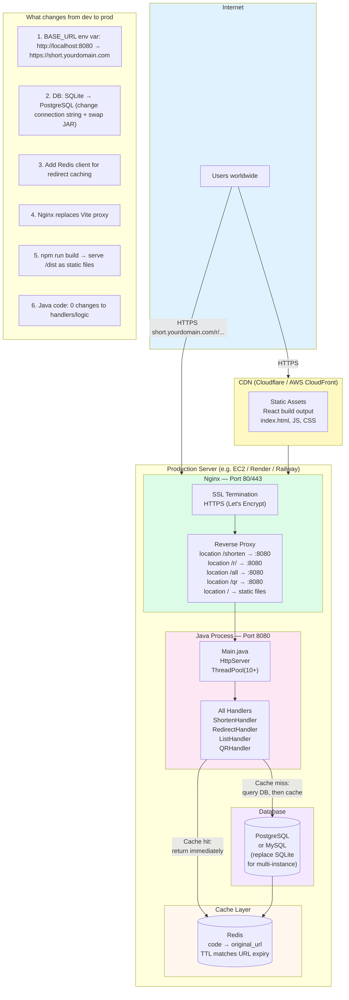

---

## 17. Package Dependency Graph

Shows which Java package depends on which — and what the allowed dependencies are.

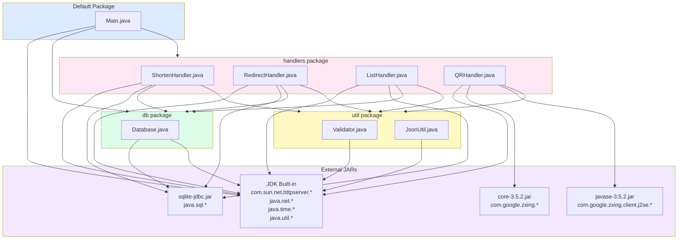

---

## 18. Data Lifecycle — A URL from Birth to Expiry

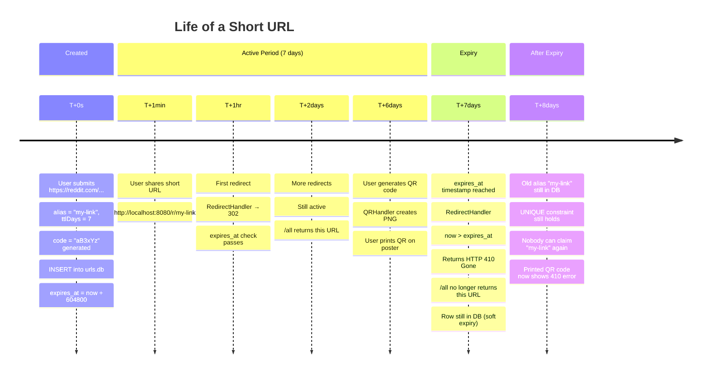

---

## 19. CORS Preflight Flow

```mermaid
sequenceDiagram
    participant Browser
    participant Vite as Vite Proxy :5173
    participant Java as Java Backend :8080

    Note over Browser,Java: Step 1 — Browser sends CORS preflight (OPTIONS)
    Note over Browser: Browser sees fetch() to a different origin<br/>Must ask permission first

    Browser->>Vite: OPTIONS /shorten HTTP/1.1<br/>Origin: http://localhost:5173<br/>Access-Control-Request-Method: POST<br/>Access-Control-Request-Headers: Content-Type

    Vite->>Java: Forwards OPTIONS request

    Java->>Java: handler sees OPTIONS method<br/>calls JsonUtil.sendCors(exchange)

    Java->>Java: Set headers:<br/>Access-Control-Allow-Origin: *<br/>Access-Control-Allow-Methods: GET, POST, OPTIONS<br/>Access-Control-Allow-Headers: Content-Type<br/>sendResponseHeaders(200, -1)

    Java-->>Vite: HTTP 200 (with CORS headers)
    Vite-->>Browser: HTTP 200 (with CORS headers)

    Note over Browser: Preflight approved.<br/>Now sends actual request.

    Note over Browser,Java: Step 2 — Actual POST request
    Browser->>Vite: POST /shorten<br/>Content-Type: application/json<br/>{"url":"...","alias":"..."}

    Vite->>Java: Forwards POST

    Java->>Java: ShortenHandler processes request
    Java-->>Vite: HTTP 200 with CORS headers + JSON body
    Vite-->>Browser: Response

    Note over Browser: Browser checks Access-Control-Allow-Origin: *<br/>Allows JavaScript to read the response
```

---

## 20. Handler Routing Map

Shows exactly which URL patterns hit which handler and what HTTP methods are supported.

```mermaid
graph LR
    subgraph INCOMING["Incoming Requests to :8080"]
        R1["POST /shorten\nbody: {url, alias, ttlDays}"]
        R2["OPTIONS /shorten\n(CORS preflight)"]
        R3["GET /r/aB3xYz\n(random code)"]
        R4["GET /r/my-link\n(custom alias)"]
        R5["GET /all"]
        R6["OPTIONS /all"]
        R7["GET /qr?url=http://..."]
        R8["OPTIONS /qr"]
        R9["POST /r/...\nGET /shorten\nor any wrong method"]
    end

    subgraph ROUTING["Main.java — createContext()"]
        C1["context: /shorten"]
        C2["context: /r/"]
        C3["context: /all"]
        C4["context: /qr"]
    end

    subgraph HANDLERS["Handlers"]
        SH["ShortenHandler\n→ validate URL\n→ validate alias\n→ generate code\n→ INSERT\n→ 200 JSON"]
        RH["RedirectHandler\n→ lookup alias OR code\n→ check expiry\n→ 302 / 404 / 410"]
        LH["ListHandler\n→ SELECT non-expired\n→ 200 JSON array"]
        QH["QRHandler\n→ decode URL param\n→ ZXing generate PNG\n→ 200 image/png"]
        ERR["405 Method Not Allowed"]
        CORS["sendCors()\n200 + CORS headers"]
    end

    R1 --> C1 --> SH
    R2 --> C1 --> CORS
    R3 --> C2 --> RH
    R4 --> C2 --> RH
    R5 --> C3 --> LH
    R6 --> C3 --> CORS
    R7 --> C4 --> QH
    R8 --> C4 --> CORS
    R9 --> ERR

    style SH fill:#dcfce7
    style RH fill:#dbeafe
    style LH fill:#fef9c3
    style QH fill:#fce7f3
    style ERR fill:#fca5a5
    style CORS fill:#f3e8ff
```

---

> **Tip for interviews:** When asked to draw a diagram on a whiteboard, start with Diagram 2 (HLD) to show the big picture, then drill into whichever layer the interviewer is interested in. Have Diagram 5 (POST /shorten sequence) ready to walk through step by step — it covers the most ground in one diagram.
